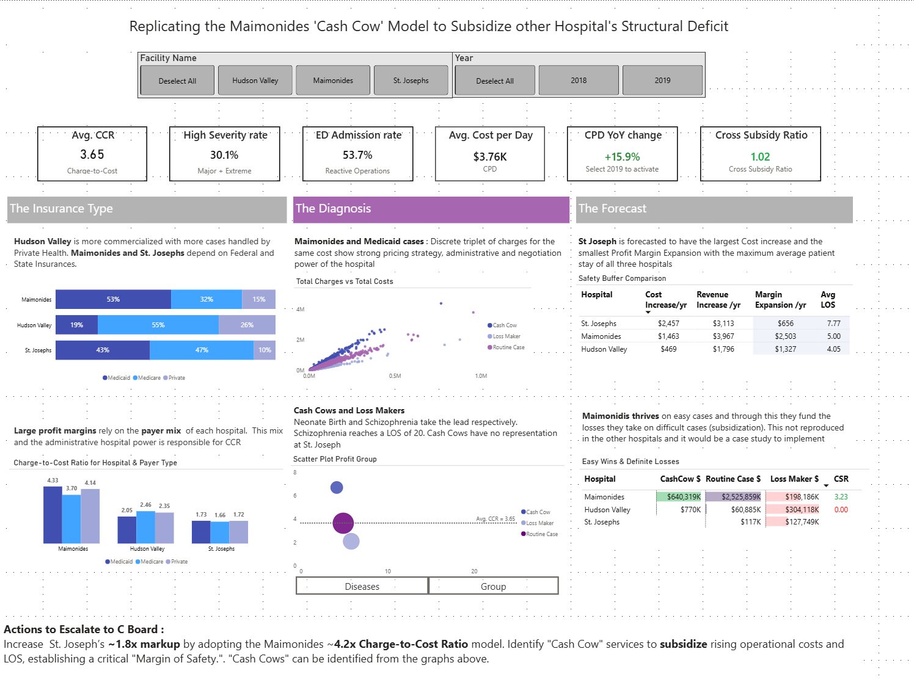
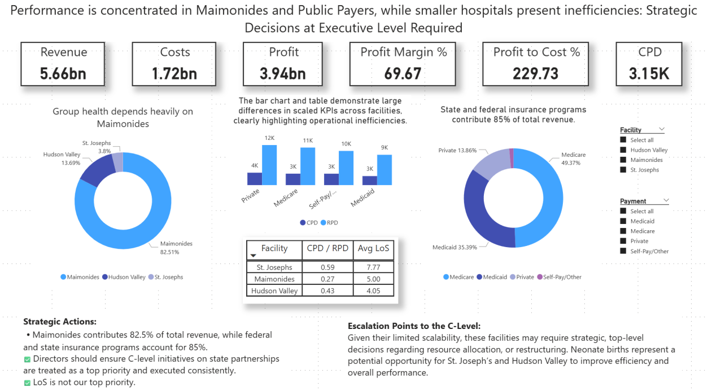
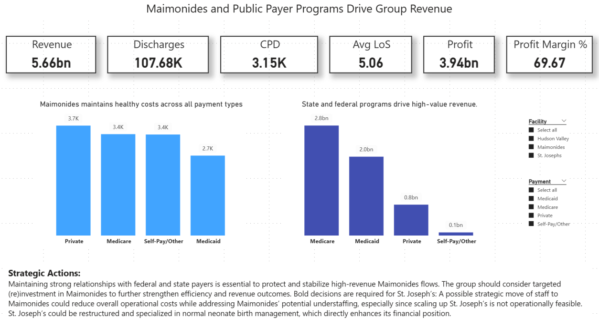

# Strategic Insights from Technical to Management Level: Private Hospital Finance

A multi-level Power BI dashboard suite analyzing hospital discharge, cost, and revenue data across three private hospitals, built for the Data Visualization course (ITC6004B1) at The American College of Greece.

**Authors:** [Katerina Psallida](https://github.com/kpsalida) & [Kimon Lappas](https://github.com/kitlapp)

---

## Overview

Patient discharge data is directly tied to hospital efficiency, operational cost, and quality of care. This project explores costs, revenues, and patient flow across three hospitals — **Maimonides**, **Hudson Valley**, and **St. Joseph's** — to uncover where profitability is concentrated, where inefficiencies hide, and what strategic actions each level of management should take.

Rather than a single dashboard, the project presents the *same underlying data* through three different lenses, matched to how each audience actually makes decisions:

| Level | Focus |
|---|---|
| **Technical** | Detailed KPIs, insurance mix, diagnosis-level cost analysis, and forecasting |
| **Director** | Cross-facility comparisons and performance benchmarking |
| **C-level** | A simplified, minute-long view of the KPIs that matter most |

## Dashboards

### Technical Dashboard

Breaks down charge-to-cost ratios, insurance mix, and diagnosis-level profitability ("cash cows" vs. "loss makers") per hospital, plus a 2020 cost forecast.

### Director Dashboard

Compares revenue, cost, and profit concentration across facilities — highlighting that Maimonides alone drives 82.5% of group revenue, and that state/federal payers account for 85% of total revenue.

### C-Level Dashboard

A six-KPI summary (Revenue, Discharges, CPD, Avg. Length of Stay, Profit, Profit Margin) built to be read in under a minute.

## Key Findings & Strategic Recommendations

1. **(Re)invest in Maimonides** to strengthen its position within the group — it's the clear performance leader.
2. **Secure and expand relationships with state/federal payers**, who drive the large majority of group revenue.
3. **Reallocate staff from St. Joseph's to Maimonides** to address potential understaffing at Maimonides while reducing St. Joseph's operating costs.
4. **Restructure St. Joseph's around high-profitability cases** (e.g., normal neonate births) to directly improve its revenue position.

## Data & Tools

- **Data source:** [NY SPARCS Hospital Inpatient Discharges (2018–2019)](https://health.data.ny.gov/Health/Hospital-Inpatient-Discharges-SPARCS-De-Identified/4ny4-j5zv)
- **Preprocessing & EDA:** Python (pandas, statistical analysis, regression/clustering, forecasting) in Google Colab
- **Dashboards:** Power BI Desktop
- **Report & presentation:** MS Word, PowerPoint

The full data preprocessing and exploratory analysis notebook (with raw data hosted for direct reproducibility) lives in a companion repository:
👉 **[kitlapp/Data_Viz](https://github.com/kitlapp/Data_Viz)** — open `visualization_eda.ipynb`, click "Open in Colab," and run all cells.

## Files in This Repository

| File | Description |
|---|---|
| `Technical.pbix` | Technical-level Power BI dashboard |
| `Director_and_C.pbix` | Director and C-level dashboards (two report pages) |
| `Report.pdf` | Full written report (~4,700 words) covering methodology, EDA, and strategic analysis |
| `Presentation.pdf` / `Presentation.pptx` | Project presentation slides |

## My Contribution

*[Add a couple of sentences here on what you specifically led — e.g., the Power BI dashboard design and build, or specific sections of the analysis/report. Being specific about your part of a group project is exactly what makes a joint-project repo credible to a recruiter.]*

---

*Class project for ITC6004B1 – Data Visualization, Winter Term 2026, The American College of Greece.*
